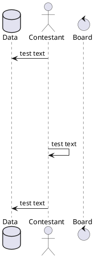

Attempting to use markdown UML with https://github.com/plantuml/plantuml :

```plantuml
@startuml
actor       Contestant
database    Data

participant Contestant
control     Board

Contestant -> Data: test text

|||
|||
|||
|||
|||
|||

Contestant -> Contestant: test text

|||
|||
|||

Contestant -> Data: test text


@enduml
```

